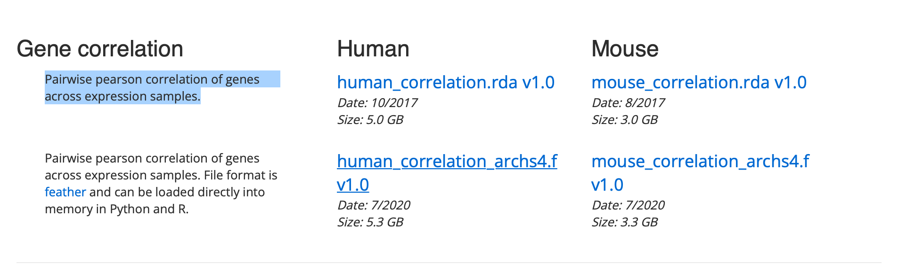

Augmentating a Gene Set list from HuBMap with a Correlation Matrix on ARCHS4
=================================================

## Motivation
We have this ASCT + B table (Anatomical Structures and Cell Types plus Biomarkers) from HuBMap that people are manually creating to identify biomarkers for cell type identification for single RNA-seq analysis. The tables are actively updated with new cell types and biomarkers. This scripts in this repository serves to update the ASCT+B GMT files on Enrichr. For each tissue there is a GMT file and has all the cell types within the tissue. We want to augment the gene sets with co-expression and update the files on Enrichr because the gene sets are short. We want to take ARCHS4 human gene correlation matrix and more genes to each small set of biomarkers for each cell type. By doing this with the hope the GMT file will be better at identifying cell types.

Table of Contents 
-----------------
* [Overview](#overview)
* [Usage](#usage)
* [About-HubMap](#About-HubMap)
* [Authors and history](#authors-and-history)
* [Acknowledgments](#acknowledgments)
* [References](#references)


## Overview
Part 1 (Expanding the gene set list associated with a cell type)
------------------------------------------------------------------
This repository contains a python script that given a gene correlation matrix in the form of an feather object, finds the top 100 coexpressed gene per gene and store in a dictionary. In the dictionary the key is the gene and value is a list of the top 100 gene with correlation value closest to 1.

Then given a gene set text file where the first column is the cell type and the following columns are the gene set list associated with the cell type,
find the top 100 average genes that coexpresses with the gene set list. Higher weight is given to genes that correlated to multiple genes in the gene set list.

This script generates a tsv file where the first column is the cell type and the following columns are the original gene set list concatenated with the top 100 coexpressed genes.

Part 2 (Extracting Gene Expression Data from ARCHS4 and generating tissue specific correlation matrix)
--------------------------------------------------------------------------------------------------------
This repository also contains a python script that will extract the gene expression data from the human h5 file from ARCHS4. Each sample in the gene expression data is specific to tissue type. We specifically interested in sample tissue from organs including Eye, Fallopian Tube, Heart, Kidney, Large Intestine, Liver, Lung, Lymph Node, Pancreas, Placenta, Prostate, Thymus, Ureter, Urinary Bladder, and Uterus. Due to large sample size (GSM), we downsampled by removing single cell samples, leaving RNA-seq samples in the gene expression data.

The expression data is normalized using counts adjusted with TMM factors (CTF) and then log transformed using asinh. A pairwise correlation matrix is then generated from the tissue specific expression data. Correlation coefficents are calculated using the pearson correlation's. Normalization reccomendations for RNA-seq data can be found [Here](https://genomebiology.biomedcentral.com/articles/10.1186/s13059-021-02568-9). A repeat of part 1 is followed except we will use the newly generated tissue specific correlation matrix as input. 




## Data Download
We augmented a gene set list using a correlation matrix. The gene correlation matrix was downloaded from [ARCHS4](https://maayanlab.cloud/archs4/download.html). The correlation matrix contain a Pairwise pearson correlation of genes across expression samples. The gene set list was generated from a asct+B converter script found in the [Ma'ayan Respository](https://github.com/MaayanLab/asct-b-converter). 

H5 file containing the human expression data from thousands of GSM samples can be found on [ARCHS4](https://maayanlab.cloud/archs4/data.html)

Tissue Specific Gene Expression (Un-normalized) [Expression Matrix Download](https://www.dropbox.com/sh/9f2e55b5raj2sce/AACD_elmL0SWN3iIrHeYuEpua?dl=0)

Tissue Specfic Gene Correlation Matrix [Correlation Matrix Download](https://www.dropbox.com/sh/lyl9p6iztglnct2/AABr4GYjpB9R3EGpSrV6LjfSa?dl=0)

## About-HuBMAP
The goal of HuBMAP is to create a reference atlas of the healthy human body at single-cell resolution. To achieve that goal, researchers must be able to name and map the trillions of cells and the many distinct cell types that make up the human body. Different cell types perform different functions. While some cell types appear throughout the body, some only exist in certain organs. Authoring and organizing information about all those different cells is the role of HuBMAP’s Anatomical Structures and Cell Types plus Biomarkers or ASCT+B table effort. The ASCT+B table is a scientific organizational framework where we take anatomical structures, AS, CT, cell types, and biomarkers and organize this information into an ontologically relevant framework where many different researchers and many different data managers from different backgrounds can collectively see, align, understand, and then use information about biological taxonomies across the whole body. ASCT+B tables are complex. In fact, each table represents a partonymy tree and two bimodal networks. All ASCT+B tables are in close alignment with existing ontologies like Uberon or CL to support effective collaboration and data sharing. ASCT+B Tables are important for biomedical research because there are not enough standards in the field for biomedical researchers to use, align, and share information on. Experts can author these tables and reviewers review them through the ASCT+B Reporter Visualization.

## Usage
- Clone the repository
```bash
git clone 'https://github.com/beagan-svg/HuBMap-Augmented-Gene-Set'
```
- Navigate to each subdirectory and execute its readme 

## Authors and History

* Beagan Nguy - Algorithm Design

## Acknowledgments

Ma'ayan Laboratory
 
## References 
- [1] Massive mining of publicly available RNA-seq data from human and mouse | Nature Communications. (n.d.). Retrieved March 11, 2022, from https://www.nature.com/articles/s41467-018-03751-6
- [2] Johnson, K. A., & Krishnan, A. (2022). Robust normalization and transformation techniques for constructing gene coexpression networks from RNA-seq data. Genome Biology, 23(1), 1. https://doi.org/10.1186/s13059-021-02568-9


