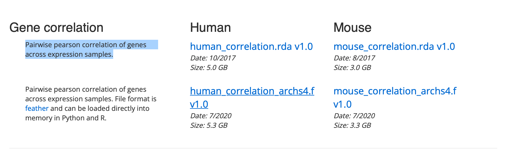

# HuBMap-Augmented-Gene-Set

Augmentating a Gene Set list from HuBMap with a Correlation Matrix on ARCHS4
=================================================

## Introduction 

This repository contains a python script that given a gene correlation matrix in the form of an feather object, finds the top 100 coexpressed gene per gene and store in a dictionary. In the dictionary the key is the gene and value is a list of the top 100 gene with correlation value closest to 1.

Then given a gene set text file where the first column is the cell type and the following columns are the gene set list associated with the cell type,
find the top 100 average genes that coexpresses with the gene set list. Higher weight is given to genes that correlated to multiple genes in the gene set list

This script generates a tsv file where the first column is the cell type and the following columns are the original gene set list concatenated with the top 100 coexpressed genes

Table of Contents 
-----------------
* [Overview](#overview)
* [Usage](#usage)
* [Authors and history](#authors-and-history)
* [Acknowledgments](#acknowledgments)
* [References](#references)


## Overview
We augmented a gene set list using a correlation matrix. The gene correlation matrix was downloaded from [ARCHS4](https://maayanlab.cloud/archs4/download.html). The correlation matrix contain a Pairwise pearson correlation of genes across expression samples. The gene set list was generated from a asct+B converter script found in the [Ma'ayan Respository](https://github.com/MaayanLab/asct-b-converter). 



## Usage
- Clone the repository
```bash
git clone 'https://github.com/beagan-svg/HuBMap-Augmented-Gene-Set-'
```
- Navigate to each subdirectory and execute its readme 

## Authors and History

* Beagan Nguy - Algorithm Design

## Acknowledgments

Ma'ayan Laboratory
 
## References 
- [1] Massive mining of publicly available RNA-seq data from human and mouse | Nature Communications. (n.d.). Retrieved March 11, 2022, from https://www.nature.com/articles/s41467-018-03751-6

