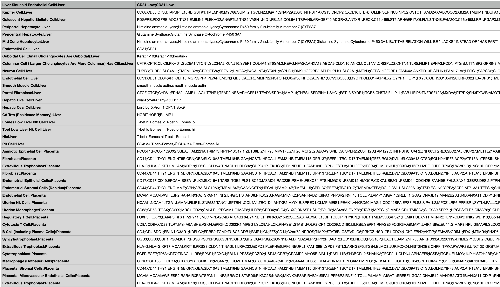

## Data
This folder contains the tissue specific augmented GMT files. Sample tissue from organs includes, Eye, Fallopian Tube, Heart, Kidney, Large Intestine, Liver, Lung, Lymph Node, Pancreas, Placenta, Prostate, Thymus, Ureter, Urinary Bladder. Organs samples to be added includes, Small Intestine, Peripheral Nervous System, Skin, Spleen, Bone Marrow, Blood Vasculature, Lymph Vasculature, and Uterus. 

